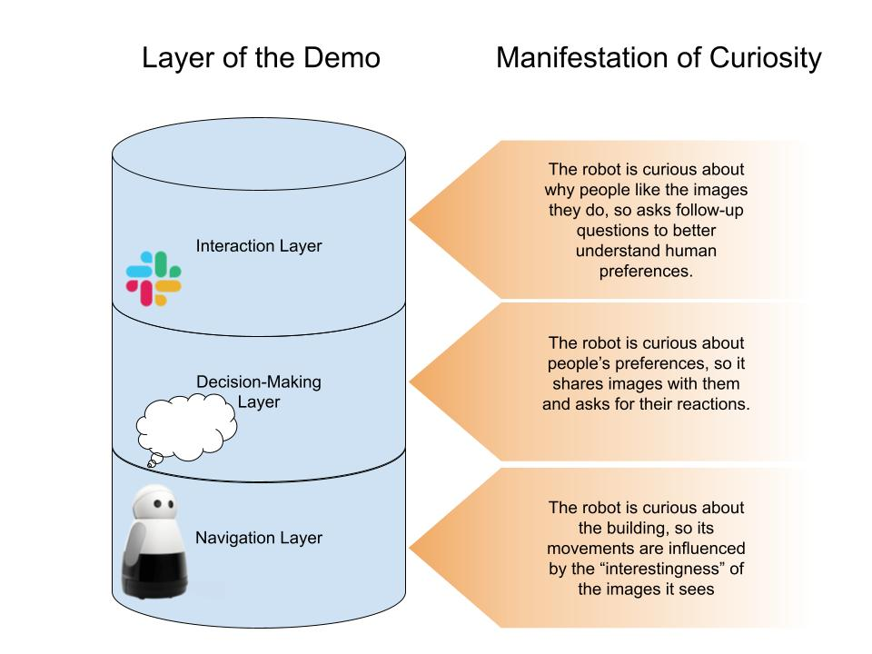
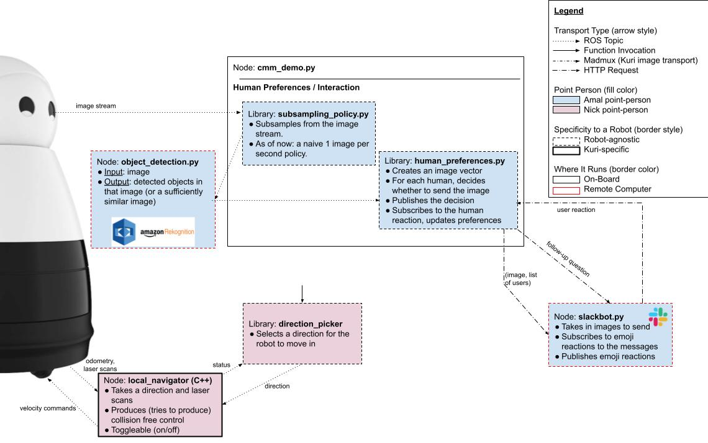
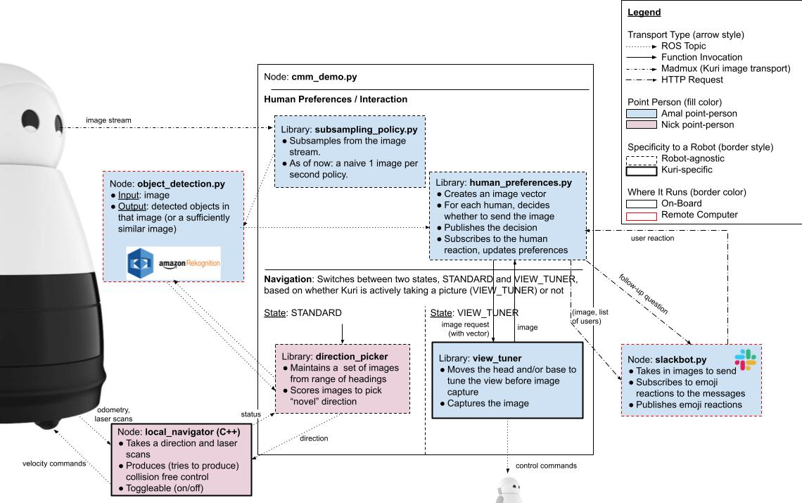

# Kuri CMM Demo (Sp 2021)

This repository contains code to run the UW+UCSC demo for the [Curious Minded Machine](https://cmm.usa.honda-ri.com/) project. The demo is broadly divided into three components: navigation, decision making, and interaction. These components broadly correspond to the `local_coverage_navigation`, `kuri_cmm_demo`, and `slackbot` repositories, respectively.

This readme provides an overview of the demo and a getting started guide.

## Overview

The below diagram describes the three components of the demo, and the way in which curiousity manifests in each component.

The below diagram visually describes the architecture of our current system.

The below diagram visually describes the architecture of our target system.

## Getting Started

### Hardware Requirements
- A Kuri robot. The decision-making and and interaction components are robot agnostic (as of now), but the navigation component is robot-specific.
- A remote computer, configured to enable a Flask app to run on it on ports 8193 and 8194 (instructions under "Slackbot" below). This computer should always be on, to recieve user responses to Slack messages.
- [TBD] A remote computer (could be the same as above) to run `object_detection_db.py` as a ROS node. Currently, we run this node on-board the robot, but as we further develop this node (and it needs to locally store images and detected objects), we envision running it on a remote computer.

### Running Code On-Board the Robot: Dockerfiles

Both the `local_coverage_navigation` and the `kuri_cmm_demo` directories use Docker containers to isolate ROS versions and ensure the appropriate dependencies are installed. The appropriate dockerfiles are included in the directories. Please refer to our [wiki on using Docker with Kuri](https://github.com/hcrlab/wiki/wiki/Robots:-Kuri:-Docker) for more details.

### Slackbot

Refer to the [readme in the slackbot directory](./slackbot/README.md). This code must run on a remote computer, so that it is guarenteed to be always on.

### Navigation

Refer to the [readme in the local_coverage_navigation directory](./local_coverage_navigation/README.md).

### Decision Making

Refer to the [readme in the kuri_cmm_demo directory](./kuri_cmm_demo/README.md).
