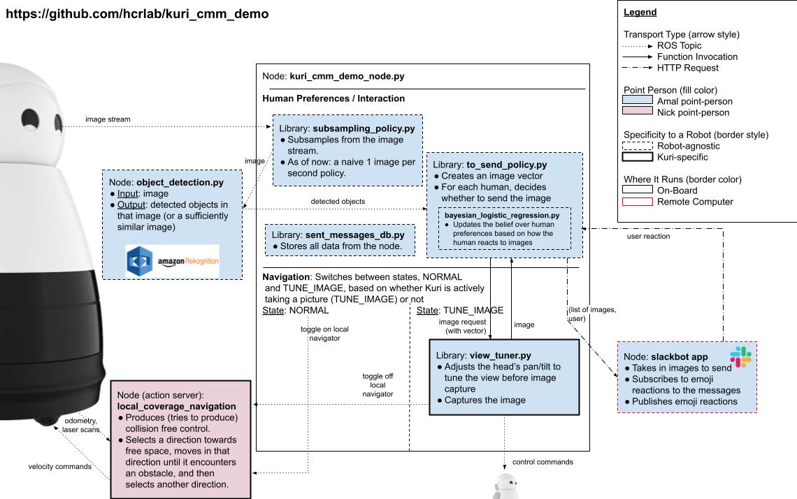

# Kuri CMM Demo (Decision-Making Node)

This directory contains the central executive node and launchfile for this demo, including the decision-making code (i.e., who to send what image(s) to).

## Configuring AWS Rekognition

We recommend users follow Steps 1 & 2 in [Getting Started with AWS Rekognition](https://docs.aws.amazon.com/rekognition/latest/dg/getting-started.html) to configure their AWS account.

## Configuring the Node

In `kuri_cmm_demo/kuri_cmm_demo/launch/kuri_cmm_demo.launch`, change the `slackbot_url` rosparam to the url for the remote server that you are running the slackbot on (be sure to point to port 8194 on that server, or 3001 if you have toggled off the `is_deployed` flag in `slackbot/app/run.py`).

In the same launchfile, set the `aws_region_name` and `aws_profile_name` to the values you configured in Step 2 of [Getting Started with AWS Rekognition](https://docs.aws.amazon.com/rekognition/latest/dg/getting-started.html).

## Running the Node

### Docker

If you are running the code with Docker (see our [wiki entry on using Docker with Kuri](https://github.com/hcrlab/wiki/wiki/Robots:-Kuri:-Docker)), first build the Docker container. Then, run it with the following (NOTE: `my-image` will have to change, and the paths to the workspaces might have to as well).

```
sudo docker run --rm --network host -v /home/mayfield/workspaces/my_workspace:/workspace -v /home/mayfield/.aws:/root/.aws -v /mayfield:/mayfield -it my-image
```

Note that we ran the code on three different Kuri's and noticed the need for slightly different Dockerfiles for each. Specifically, the two changes were:
- One of our Kuri's had trouble with `apt update` and needed an up-to-date key. In order to enable that, uncomment lines 3-4 of the Dockerfile and comment line 5.
- One of our Kuri's had an issue with lsb_release between python2 and python3. To fix this, uncomment line 40.

We would recommend first attempting to use the Dockerfile as-is. If you run into issues, then we would recommend you try the above changes to the Dockerfile before doing further debugging (note that you have to rebuild the image after every modification of the Dockerfile).

Then, build the workspace inside the Docker container, likely using `catkin_make`.

### Network Configuration

Note that you will have to do some network configuration to enable the nodes on the inside and outside of the Docker container to communicate with one another. The script `../env.sh` should help with this. To use it, first run `hostname -I` (either inside or outside the docker container) to determine the index of the target IP you want ROS to use (referred to as `[INDEX]` below). Then, outside the Docker container, first source your workspace (`source devel.setup.bash`) and then source env.sh (`source env.sh [INDEX] core`). Then, inside the Docker container, first source your workspace and then source env.sh as `source env.sh [INDEX]`. This should properly setup your network for the nodes running on the inside and outside of the docker container to communicate with each other. For more details, see our [wiki entry on using Docker with Kuri](https://github.com/hcrlab/wiki/wiki/Robots:-Kuri:-Docker).

### Launching the Nodes

In your workspace outside the Docker container, ensure that you have pulled and built the latest files from the [kuri](https://github.com/hcrlab/kuri/tree/melodic-devel) repository, and are in the `melodic_devel` branch. (Note that this branch will still build on ROS Indigo, which is native to Kuri. It is called `melodic_devel` because it is intended to interace with the `kuri_cmm_demo_node`, which is run in ROS Melodic.) Then, run `roslaunch kuri_launch kuri.launch use_camera:=true use_navigation:=false`. Note that this *has* to be run outside the container in order to communicate eith Kuri's hardware and sensors.

Inside the Docker container, run `roslaunch kuri_cmm_demo kuri_cmm_demo.launch`.

## How the Node Works

Below is a visual representation of the node and its components:



### Node State Machine

This node has five states: NORMAL, INITIALIZE_TUNER, TUNE_IMAGE, TAKE_PICTURE, and CHARGING. Below, we briefly describe the states and their trainsitions.

- NORMAL toggles on the `local_coverage_navigation` action server. It then subscribes to images, and sends them to the `to_send_policy`. If the `to_send_policy` decides to send the image to at least one user, NORMAL transitions to INITIALIZE_TUNER.
- INITIALIZE_TUNER initializes the `view_tuner` with the current image (to initialize optical flow), and toggles the `local_coverage_navigation` action server off.
- TUNE_IMAGE adjusts the head's pan and tilt to center the region of greatest saliency in the image. Once the region of greatest saliency is centered (or the tuner is unable to center the region), it transitions to TAKE_PICTURE. To tune the head, we use the approach in: Vázquez, Marynel, and Aaron Steinfeld. "An assisted photography method for street scenes." 2011 IEEE Workshop on Applications of Computer Vision (WACV). IEEE, 2011.
- TAKE_PICTURE captures the image, stores it locally, and transitions back to NORMAL.
- Whereas the above 4 states form a cycle, CHARGING breaks that cycle. When the robot is in NORMAL, if it's battery is below the `to_charge_threshold` and it detects that it is on the dock, it will transition to CHARGING. When in CHARGING, its eyes will remain closed, and it will toggle the `local_coverage_navigation` action server off. It will also continually check the battery status. If the battery is either above `charging_done_threshold` or the robot is moved off of its charger, it transitions back to NORMAL.

### Communicating with the Slackbot

Concurrently to the state machine, the robot has another thread that continuously receives updates from the Slackbot. These updates include: (a) any new received reactions to sent images; and (b) how many seconds till each user should receive images from the robot. With regards to (a), the robot updates its belief over the human's image preferences, handled in `to_send_policy.py` and `bayesian_logistic_regression.py`. With regards to (b), the robot loads every stored image for that user, computes the probability that the user will like them (using its most up-to-date belief over the user's image preference), and sends the top 5 to the Slackbot.

The robot separately subscribes to its batter level messages. When that first goes below pre-specified thresholds (`battery_notification_thresholds`), it sends a low battery alert to the Slackbot, which forwards it to the person whose job it is to return Kuri to its base.

## Using This Node On Other Robots

Although this node was designed to work on Kuri, below we detail the changes that would need to be made to make it work on other robots.

The following parts of this node are robot-specific:
- In the NORMAL state, it toggles on and off the `local_coverage_navigation` action server.
- In the INITIALIZE_TUNER and TUNE_IMAGE states, the `view_tuner` adjusts Kuri's head's pan/tilt to center the most salient region of the image.
- In the CHARGING state, it subscribe's to Kuri's battery messages to determine when to stop charging.
- The `open_eyes` and `close_eyes` functions.

Therefore, to make the node robot-agnostic (where it only relies on a ROS Topic of CompressedImage messages), you would have to do the following:
- Remove every instance in `kuri_cmm_demo_node.py` that invokes the `local_coverage_navigator_action`.
- Remove every instance in `kuri_cmm_demo_node.py` that invokes the `view_tuner`. Perhaps the easiest way to do this is to have NORMAL transition directly to TAKE_PICTURE, and then removing calls to `view_tuner` only in NORMAL and TAKE_PICTURE (e.g., re-centering the head, de-initializing the tuner, etc.)
- Removing the subscription to battery messages (`battery_sub`) and removing the part of the NORMAL state that would transition to the CHARGING state.
- Removing every invokation of `open_eyes` and `close_eyes`.

Note that the above steps are to remove the node's reliance on a robot altogether, and to enable it to work with any arbitrary ROS Topci of CompressedImage messages. If you want to enable it to work with a robot other than Kuri, you will have to modify the `local_coverage_navigation` action server, the `view_tuner`, and how charging works to make it work for the other robot.

## Misc Scripts

The following scripts are not part of the ROS nodes that run on the robot:
- `learn_prior.py`: this is the script that generates the prior to use for unseen users. Our pre-generated prior is included in the code at `./cfg/prior.npz`. If you remove the prior file, it is assumed to be a zero-mean prior.
- `run_robot.sh`: this script is very specific to our Kuri and was used to run the code (both `kuri.launch` outside the docker and `kuri_cmm_demo.launch` inside the docker) on our robot. Although the paths in the script will likely have to be changed, it might give you some pointers, which is why we included it.
- `test_view_tuner.py`: this script subscribes to the `/tune_image` topic. Whenever a ROS message is sent to that topic, it invokes the view tuner, and moves the head to center the region of greatest saliency in the robot's view.
